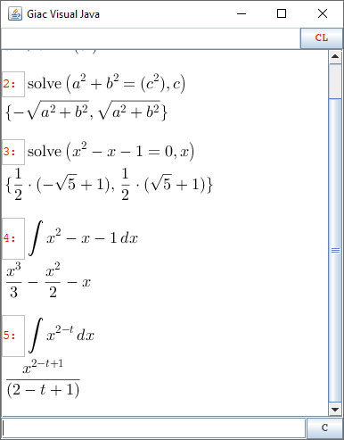

# Giac Visual Java

Java Swing Interface for: 
[Giac/xcas, a free computer algebra system](https://www-fourier.ujf-grenoble.fr/~parisse/giac.html)

Giac-Visual-Java is a computer algebra system (CAS) or symbolic algebra system (SAS), 
is a software with the ability to manipulate mathematical expressions in a way similar 
to the traditional manual computations of mathematicians and scientists.

Example how to use:

[https://youtu.be/4ukK9IfMD9E](https://youtu.be/4ukK9IfMD9E)

By:
   [www.diegocueva.com](http://www.diegocueva.com)
   
   
Licence: 
GNU GENERAL PUBLIC LICENSE
Version 3, 29 June 2007
https://www.gnu.org/licenses/gpl-3.0.html